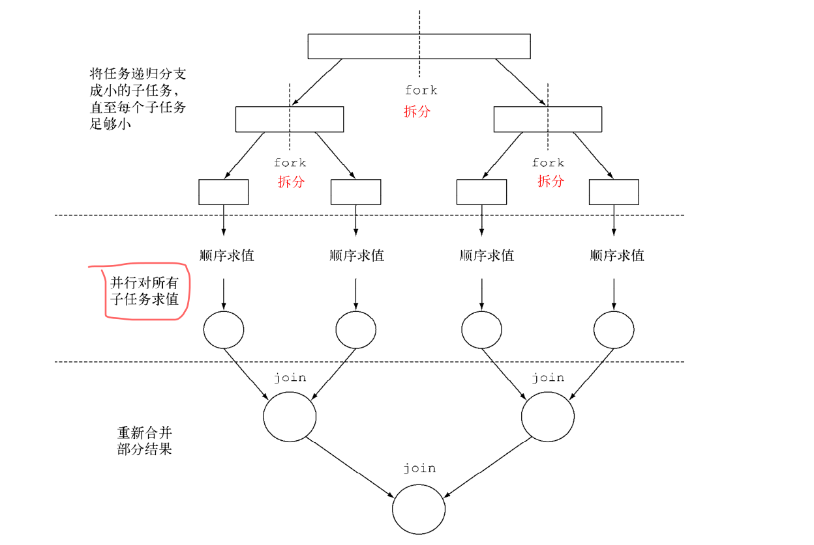

# 分支/合并框架详解

**分支框架的目的是以递归的方式将可以并行的任务拆分成更小的任务,然后将每个子任务的结果合并起来生成整体结果.**

它是 ExecutorService 接口的一个实现,他把子任务分配给线程池(ForkJoinPool)中的线程.


## 使用 RecursiveTask

要把任务提交到池,必须创建 RecursiveTask<V> 的一个子类,其中V是并行化任务产生的结果类型,

RecursiveTask类源码:
```java
public abstract class RecursiveTask<V> extends ForkJoinTask<V> {
    private static final long serialVersionUID = 5232453952276485270L;

    /**
     * The result of the computation.
     */
    V result;

    /**
     * The main computation performed by this task.
     * @return the result of the computation
     */
    protected abstract V compute();

    public final V getRawResult() {
        return result;
    }

    protected final void setRawResult(V value) {
        result = value;
    }

    /**
     * Implements execution conventions for RecursiveTask.
     */
    protected final boolean exec() {
        result = compute();
        return true;
    }

}
```

要定义 RecursiveTask， 只需实现它唯一的抽象方法compute ：

```java
@Override
    protected Long compute() {

        return null;
    }
```

**这个方法定义了将任务拆分成子任务的逻辑,以及无法再拆分或不便再拆分,生成单个子任务结果的逻辑.**


即(伪代码如下):
```java
if (任务足够小或不可分) {
    顺序计算该任务
} else {
    将任务分成两个子任务
    递归调用本方法，拆分每个子任务，等待所有子任务完成
    合并每个子任务的结果
}
```

递归的任务拆分过程如图:



如果你了解著名的分治算法,会发现这不过是分支算法的并行版本而已.

接下来我们举一个用分支/合并框架的实际例子，还以前面的例子为基础，让我们试着用这个框架为一个数字范围（这里用一个long[] 数组表示）求和

```java
/**
 * 分支合并框架测试
 *
 * @author itguang
 * @create 2017-11-18 14:22
 **/
public class ForkJoinTest extends RecursiveTask<Long> {

    //要处理的任务数组
    private final long[] numbers;

    //子任务处理数组的起始和结束位置
    private final int start;
    private final int end;

    //阀值,当数组小于10000就并行执行
    public static final long THRESHOLD = 10000;

    //公共构造函数,用于创建子任务


    //私有构造函数,用于 以递归方式为主任务创建子任务
    public ForkJoinTest(long[] numbers, int start, int end) {
        this.numbers = numbers;
        this.start = start;
        this.end = end;
    }

    public ForkJoinTest(long[] numbers) {
        this(numbers, 0, numbers.length);
    }


    @Override
    protected Long compute() {
        int length = end - start;

        //如果大小小于等于阀值,则顺序计算结果
        if (length <= THRESHOLD) {
            return computeSequentially();
        }

        //否则,创建一个子任务为数组的前一半求和
        ForkJoinTest leftTask = new ForkJoinTest(numbers, start, start + length / 2);
        //利用另一个 ForkJoinPool 里的线程异步执行新创建的子任务.
        leftTask.fork();
        //创建一个任务为数组的后一半求和
        ForkJoinTest rightTask = new ForkJoinTest(numbers, start + length / 2, end);
        //**递归操作**
        long rightResult = rightTask.compute();


        //遇到递归终止条件,读取本次递归第一个子任务的结果,如果尚未完成就等待
        long leftResult = leftTask.join();

        //递归累加
        return leftResult+rightResult;
    }

    //计算和
    private long computeSequentially() {

        long sum = 0;
        for (int i = start; i < end; i++) {

                sum += numbers[i];
            }
            return sum;
    }


}
```

测试:创建一个 ForkJoinPool,并把任务传递给它的invoke()方法.在ForkPool中执行时,返回结果就是ForkJoinTest的并行递归求和结果

```java
 @Test
    public void test9(){
        long[] numbers = LongStream.rangeClosed(1, 1000*10000).toArray();
        ForkJoinTest forkJoinTest = new ForkJoinTest(numbers);
        Long sum = new ForkJoinPool().invoke(forkJoinTest);
        System.out.println(sum);//50000005000000

    }
```


请注意在实际应用时，使用多个 ForkJoinPool 是没有什么意义的。正是出于这个原因，一
般来说把它实例化一次，然后把实例保存在静态字段中，使之成为单例，这样就可以在软件中任
何部分方便地重用了。这里创建时用了其默认的无参数构造函数，这意味着想让线程池使用JVM
能够使用的所有处理器。更确切地说，该构造函数将使用 Runtime.availableProcessors 的
返回值来决定线程池使用的线程数。请注意 availableProcessors 方法虽然看起来是处理器，
但它实际上返回的是可用内核的数量，包括超线程生成的虚拟内核。

当把一个ForkJoinTask 任务交给ForkJoinPool时,这个任务就由池中的一个线程执行,这个线程会调用任务的 compute 方法.
该方法会检查任务是否小到足以顺序执行，如果不够小则会把要求和的数组分成两半，分给两个新的 ForkJoinTest ，而它们也由ForkJoinPool 安排执行.

因此这一过程可以递归重复,把原任务拆分成更小的任务执行,知道满足不可炒粉的条件,在上例中是拆分数组的大小小于阀值.
这时候会从递归终止开始顺序计算每个任务的结果.然后由分支创建的二叉树遍历回它的根.接下来会合并每个子任务的部分结果，从而得到总任务的结果.

如图:


